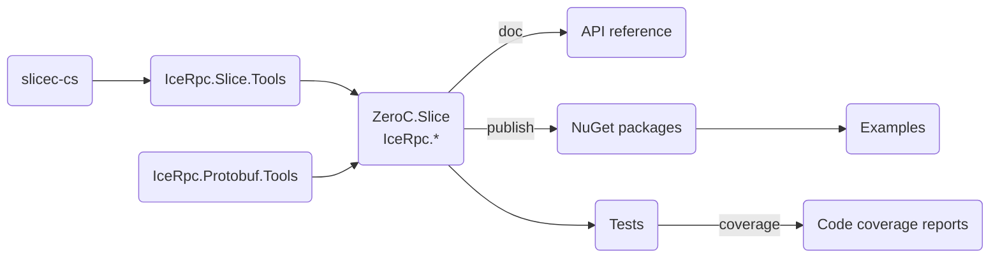

# Building from source

Use the `build` shell script to build the source code in this repository:

Linux or macOS

```shell
./build.sh --help
```

Windows

```shell
build.cmd -help
```

## Table of contents

- [Prerequisites](#prerequisites)
- [Build roadmap](#build-roadmap)
- [Building IceRpc](#building-icerpc)
  - [Command line](#command-line)
  - [Visual Studio Code](#visual-studio-code)
- [Running the tests](#running-the-tests)
  - [C# tests](#c-tests)
  - [Rust tests](#rust-tests)
- [Creating and publishing NuGet packages](#creating-and-publishing-nuget-packages)
  - [Slice tools](#slice-tools)
- [Generating the API reference](#generating-the-api-reference)
- [Generating the code coverage reports](#generating-the-code-coverage-reports)
- [Shutting down background MSBuild servers](#shutting-down-background-msbuild-servers)
- [Updating Slice files](#updating-slice-files)

## Prerequisites

1. Rust\
Install Rust using [rustup](https://rustup.rs/).

2. .NET SDK 8.0\
Download the .NET SDK from [dotnet.microsoft.com](https://dotnet.microsoft.com/en-us/download/dotnet).

3. docfx (optional)\
The IceRRC API reference is generated by [docfx](https://www.nuget.org/packages/docfx). You can install docfx as
follows:

   ```shell
   dotnet tool update -g docfx
   ```

4. ReportGenerator (optional)\
The code coverage reports are generated by [ReportGenerator](https://github.com/danielpalme/ReportGenerator). You can
install ReportGenerator as follows:

   ```shell
   dotnet tool install -g dotnet-reportgenerator-globaltool
   ```

## Build roadmap



The Slice compiler for C# (slicec-cs) is written in Rust. Everything else is written in C#.

## Building IceRpc

### Command line

Linux or macOS

```shell
./build.sh --build
```

Windows

```shell
build.cmd -build
```

This command builds all the tools, sources and tests with the default config (debug).

The -build/--build action is optional since it's the default build action.

### Visual Studio Code

Select `Tasks: Run Build Task...` from the command palette to run the build script from Visual Studio Code.

## Running the tests

### C# tests

```shell
dotnet test
```

This command executes all tests known to the `IceRpc.sln` solution. See
[dotnet-test](https://docs.microsoft.com/en-us/dotnet/core/tools/dotnet-test) for additional options.

### Rust tests

```shell
cd tools/slicec-cs
cargo test
```

This command runs the test suite for `slicec-cs`.

## Creating and publishing NuGet packages

Linux or macOS

```shell
./build.sh --publish
```

Windows

```shell
build.cmd -publish
```

This command creates all the NuGet packages and publishes them to your local `global-packages` source.

> **Note**
> This is an essential step if you want to use a local build with the [examples](examples).

### Slice tools

By default, the NuGet package `IceRpc.Slice.Tools` includes only the `slicec-cs` compiler created by the local build.

If you set the MSBuild property `SLICEC_CS_STAGING_PATH`, `IceRpc.Slice.Tools` instead includes the `slicec-cs` compiler
for all supported platforms. The expected layout of the staging directory is
`<os-name>-<os-arch>/<compiler-executable>`, with the following subdirectories:

- `linux-x64`: Linux x86_64
- `linux-arm64`: Linux ARM64
- `macos-x64`: macOS x86_64
- `macos-arm64`: macOS Apple silicon
- `windows-x64`: Windows x64

Make sure that all these compilers are available when you set `SLICEC_CS_STAGING_PATH`.

## Generating the API reference

Linux or macOS

```shell
./build.sh --doc
```

Windows

```shell
build.cmd -doc
```

This command generates the API reference into the `docfx\_site` directory. Start a local web server to view this
API reference:

```shell
docfx serve docfx/_site
```

## Generating the code coverage reports

Linux or macOS

```shell
./build.sh --coverage
```

Windows

```shell
build.cmd -coverage
```

## Shutting down background MSBuild servers

You may occasionally encounter errors when cleaning and building because background MSBuild servers use/lock the
`IceRpc.Slice.Tools` assembly. When this happens, you can shutdown these MSBuild servers with:

```shell
dotnet build-server shutdown
```

## Updating Slice files

The [slice](./slice) sub-directory is managed by a Git subtree and contains the contents of the [icerpc-slice]
repository. Updates to the files in this sub-directory must be done in the icerpc-slice repository first and then the
changes can be pulled.

The procedure to upgrade these files is as follows:

1. Open a PR (pull request) in the icerpc-slice repository with the desired changes. Once approved merge the
   PR in the icerpc-slice repository.

2. Create a companion PR for the required changes in the icerpc-csharp repository. Start by creating a branch
   for the PR and pulling the changes from icerpc-slice:

   ```shell
   git checkout -b my-branch --track origin/main
   git subtree pull --prefix slice git@github.com:icerpc/icerpc-slice.git main
   git push <remote> my-branch
   ```

3. Make the necessary C# updates, open the PR in icerpc-csharp, and iterate until it's ready for merging. The "Check
   Slice Subtree Updates" workflow job is expected to fail at this point. This is the workflow ensuring that the
   contents of slice sub-directory are not updated with a PR.

4. Once you are ready to merge you need to first merge the icerpc-slice changes into the icerpc-csharp's main branch

   ```shell
   git checkout -b main --track origin/main
   git pull
   git subtree pull --prefix slice git@github.com:icerpc/icerpc-slice.git main
   git push origin main
   ```

5. Then merge the main branch into your PR

   ```shell
   git checkout my-branch
   git merge origin/main
   git push <remote> my-branch
   ```

6. Ensure that "Check Slice Subtree Updates" workflow job passes, and that no files under slice sub-directory are
   modified by the PR.

7. Finally merge your PR as usual.

Please ensure to replace `<remote>` with the appropriate remote repository name where you want to push your changes.
Also, make sure to follow the instructions carefully, and adjust any repository and branch names as needed for your
specific setup.

[icerpc-slice]: https://github.com/icerpc/icerpc-slice
