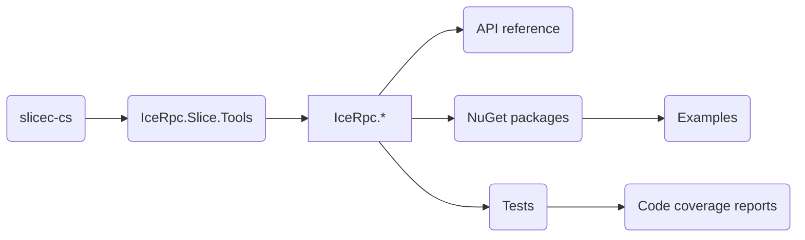

# Building from source

Use the `build` shell script to build the source code in this repository:

Linux or macOS
```shell
./build.sh --help
```

Windows
```shell
build.cmd -help
```

## Table of contents

- [Prerequisites](#prerequisites)
- [Build roadmap](#build-roadmap)
- [Building IceRpc](#building-icerpc)
  - [Command line](#command-line)
  - [Visual Studio Code](#visual-studio-code)
- [Running the tests](#running-the-tests)
  - [C# tests](#c-tests)
  - [Rust tests](#rust-tests)
- [Creating NuGet packages](#creating-nuget-packages)
  - [Slice tools](#slice-tools)
- [Publishing NuGet packages](#publishing-nuget-packages)
- [Generating the API reference](#generating-the-api-reference)
- [Generating the code coverage reports](#generating-the-code-coverage-reports)
- [Shutting down background MSBuild servers](#shutting-down-background-msbuild-servers)

## Prerequisites

1. Rust\
Install Rust using [rustup](https://rustup.rs/).

2. .NET SDK 7 or 8\
Download the .NET SDK from [dotnet.microsoft.com](https://dotnet.microsoft.com/en-us/download/dotnet).

3. docfx (optional)\
The IceRpc API reference is generated by [docfx](https://www.nuget.org/packages/docfx). You can install docfx as
follows:

```shell
dotnet tool update -g docfx
```

4. ReportGenerator (optional)\
The code coverage reports are generated by [ReportGenerator](https://github.com/danielpalme/ReportGenerator). You can
install ReportGenerator as follows:

```shell
dotnet tool install -g dotnet-reportgenerator-globaltool
```

## Build roadmap



The Slice compiler for C# (slicec-cs) is written in Rust. Everything else is written in C#.

## Building IceRpc
### Command line

Linux or macOS
```shell
./build.sh --build
```

Windows
```shell
build.cmd -build
```

This command builds slicec-cs, all the IceRpc assemblies, and the IceRpc tests with the default configuration (debug).

The -build/--build action is optional since it's the default build action.

> **Note** TEMPORARY
>
> The build system for the slicec-cs compiler fetches the slicec library from the slicec repository. If the build fails
> to fetch slicec with a permission denied error, set the following environment variable:
>
> Linux or macOS
> ```shell
> export CARGO_NET_GIT_FETCH_WITH_CLI=true
> ```
>
> Windows
> ```shell
> set CARGO_NET_GIT_FETCH_WITH_CLI=true
> ```

### Visual Studio Code

Select `Tasks: Run Build Task...` from the command palette to run the build script from Visual Studio Code.

## Running the tests

### C# tests

```shell
dotnet test
```

This command executes all tests known to the `IceRpc.sln` solution. See
[dotnet-test](https://docs.microsoft.com/en-us/dotnet/core/tools/dotnet-test) for additional options.

### Rust tests

```shell
cd tools/slicec-cs
cargo test
```

This command runs the test suite for `slicec-cs`.

## Creating NuGet packages

Linux or macOS
```shell
./build.sh --build --pack
```

Windows
```shell
build.cmd -build -pack
```

This command creates all the IceRpc NuGet packages.

### Slice tools

By default, the NuGet package `IceRpc.Slice.Tools` includes only the `slice-cs` compiler created by the local build.

If you set the MSBuild property `SLICEC_CS_STAGING_PATH`, `IceRpc.Slice.Tools` instead includes the `slicec-cs` compiler
for all supported platforms. The expected layout of the staging directory is
`<os-name>-<os-arch>/<compiler-executable>`, with the following subdirectories:
- `linux-x64`: Linux x86_64
- `linux-arm64`: Linux ARM64
- `macos-x64`: macOS x86_64
- `macos-arm64`: macOS Apple silicon
- `windows-x64`: Windows x64

Make sure that all these compilers are available when you set `SLICEC_CS_STAGING_PATH`.

## Publishing NuGet packages

Linux or macOS
```shell
./build.sh --publish
```

Windows
```shell
build.cmd -publish
```

This command publishes all the NuGet packages created with `-pack/--pack` to your local `global-packages` source.

> **Note**
> This is an essential step if you want to use a local build with the [examples](examples).

## Generating the API reference

Linux or macOS
```shell
./build.sh --doc
```

Windows
```shell
build.cmd -doc
```

This command generates the API reference into the `docfx\_site` directory. Start a local web server to view this
API reference:

```shell
docfx serve docfx/_site
```

## Generating the code coverage reports

Generating the code coverage reports is a two steps process.

You first have to run the test suite with code coverage enabled to collect the code coverage data:

Linux or macOS
```shell
dotnet test -p:RunSettingsFilePath=build/Coverlet.runsettings --collect:\"XPlat Code Coverage\"
```

Windows
```shell
dotnet test -p:RunSettingsFilePath=%cd%\build\Coverlet.runsettings --collect:"XPlat Code Coverage"
```

Then you run the [reportgenerator][reportgenerator] tool to generate a code coverage report from the collected coverage data:

```shell
reportgenerator -reports:tests/*/TestResults/*/coverage.cobertura.xml -targetdir:tests/CodeCoverageReport
```

*It is important to remove any TestResults from previous runs before generating a new code coverage report,
otherwise you might get inaccurate reports*

## Shutting down background MSBuild servers

You may occasionally encounter errors when cleaning and building because background MSBuild servers use/lock the
`IceRpc.Slice.Tools` assembly. When this happens, you can shutdown these MSBuild servers with:

```shell
dotnet build-server shutdown
```

[reportgenerator]: https://github.com/danielpalme/ReportGenerator
