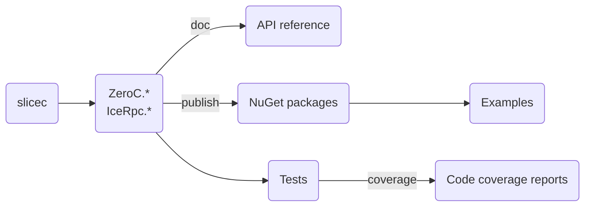

# Building from source

Use the `dotnet` command to build the source code in this repository:

```shell
dotnet build
```

## Table of contents

- [Building from source](#building-from-source)
  - [Table of contents](#table-of-contents)
  - [Prerequisites](#prerequisites)
  - [Build roadmap](#build-roadmap)
  - [Building IceRpc](#building-icerpc)
    - [Command line](#command-line)
    - [Visual Studio Code](#visual-studio-code)
  - [Running the tests](#running-the-tests)
  - [Generating the code coverage reports](#generating-the-code-coverage-reports)
  - [Generating the API reference](#generating-the-api-reference)
  - [Updating vendored Slice files](#updating-vendored-slice-files)

## Prerequisites

1. .NET SDK\
Download the .NET 10.0 SDK from [dotnet.microsoft.com](https://dotnet.microsoft.com/en-us/download/dotnet).

2. docfx (optional)\
The IceRPC API reference is generated by [docfx](https://www.nuget.org/packages/docfx). You can install docfx as
follows:

   ```shell
   dotnet tool update -g docfx
   ```

3. ReportGenerator (optional)\
The code coverage reports are generated by [ReportGenerator](https://github.com/danielpalme/ReportGenerator). You can
install ReportGenerator as follows:

   ```shell
   dotnet tool install -g dotnet-reportgenerator-globaltool
   ```

## Build roadmap


```mermaid
flowchart LR
    compiler(slicec) --> icerpc(ZeroC.*<br>IceRpc.*)
    icerpc -- doc --> api(API reference)
    icerpc -- publish --> nuget(NuGet packages) --> examples(Examples)
    icerpc --> tests(Tests) -- coverage --> cov(Code coverage reports)
```

The Slice compiler ([slicec]) compiles Slice files and invokes C# code-generator plugins to produce the generated code.

## Building IceRpc

### Command line

```shell
dotnet build
```

This command builds all the tools, sources and tests with the default config (debug).

### Visual Studio Code

Select `Tasks: Run Build Task...` from the command palette to run the build script from Visual Studio Code.

## Running the tests

```shell
dotnet test
```

This command executes all tests known to the `IceRpc.slnx` solution. See
[dotnet-test](https://docs.microsoft.com/en-us/dotnet/core/tools/dotnet-test) for additional options.

## Generating the code coverage reports

```shell
dotnet test --collect:"XPlat Code Coverage" -p:RunSettingsFilePath=build/Coverlet.runsettings
```

## Generating the API reference

```shell
cd docfx
docfx metadata --property Configuration=Debug
docfx build
```

This command generates the API reference into the `docfx\_site` directory. Start a local web server to view this
API reference:

```shell
docfx serve _site
```

## Updating vendored Slice files

The Slice files used to build IceRPC for C# are shared across repositories and originate from different source
repositories. These vendored files must be updated in their source repositories first and then synced back to the
`icerpc-csharp` repository.

The `slice.toml` file defines which files are copied from which repositories. The `build/sync-slice.py` script can
be used to sync the vendored Slice files and to verify that they are in sync with their source repositories.

[slicec]: https://github.com/icerpc/slicec
