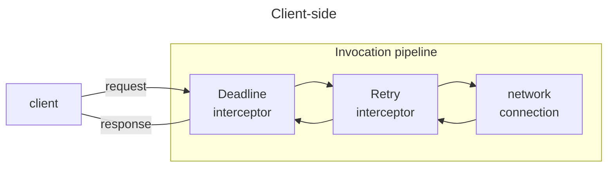
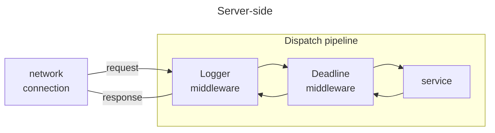

<p align="center">
  
</p>

# IceRPC for C#

[][ci-home]
[][license]

[Getting started] | [Examples] | [NuGet packages] | [Documentation] | [API reference] | [Building from source]

IceRPC is a modular RPC framework that helps you build networked applications with minimal effort.

## Built for QUIC

IceRPC was built from the ground up to take advantage of [QUIC], the new multiplexed transport that underpins [HTTP/3].

QUIC is ideally suited for RPCs: an RPC maps to a request/response pair carried by a bidirectional QUIC stream.
Multiple request/response pairs can proceed in parallel inside the same QUIC connection without interfering with each
other.

IceRPC uses its own application protocol, [`icerpc`][icerpc-protocol], to exchange connection settings, transmit
requests and responses, and ensure an orderly shutdown. This new RPC-focused protocol is a thin layer over QUIC.

### Not only for QUIC

The primary transport for IceRPC is QUIC, but we're still in the early days of QUIC, so being QUIC-only is not
practical.

To bridge this gap, IceRPC provides a multiplexing adapter called [Slic]. Slic implements a QUIC-like multiplexed
transport over any duplex transport such as TCP. This way, you can use IceRPC with QUIC, with TCP (via Slic), and with
various other traditional transports such as Bluetooth and named pipes[^1].

## Modern C# and .NET

IceRPC for C# takes full advantage of the latest C# syntax and .NET features to offer a truly modern C# API.

Chief among these features is async/await. Async/await allows you to utilize threads efficiently when making calls that
wait for I/O, and RPCs are all about network I/O. Async/await also makes your code easier to read and maintain: you can
see immediately when you make an RPC versus a local synchronous call since all RPC calls have `Async` APIs that are
usually awaited. For example:

```csharp
// Synchronous code (old RPC style)

// It's unclear if this is a remote call that takes milliseconds or a local call that takes
// at most a few microseconds. In any case, this call is holding onto its thread until it
// completes.
string greeting = greeter.Greet(name);
```

```csharp
// Asynchronous code with await (modern RPC style)

// We see it's a special call thanks to await and the Async suffix. GreetAsync releases the
// thread while waiting for the response from the peer and it's just as easy to write as
// the synchronous version.
string greeting = await greeter.GreetAsync(name);
```

> With IceRPC, all calls that make network I/O are Async and only Async. IceRPC does not provide a parallel blocking
> synchronous API.

IceRPC leverages [System.IO.Pipelines] for maximum efficiency. This allows IceRPC to rent all its byte buffers from the
same configurable memory pool.

IceRPC naturally supports cancellation just like all modern C# libraries, with trailing cancellation token parameters.
This cancellation works "across the wire": when you cancel an outstanding RPC invocation, the remote service is notified
and can in turn cancel further processing.

## Modular and extensible

When you make an RPC with IceRPC, your request and response travel through an invocation pipeline (on the client side)
and a dispatch pipeline (on the server side):





These pipelines intercept your requests and responses and you decide what they do with them. If you want to log your
requests and responses, add the Logger interceptor to your invocation pipeline or the Logger middleware to your dispatch
pipeline. If you want to retry automatically failed requests that can be retried, add the Retry interceptor to your
invocation pipeline. IceRPC provides a number of interceptors and middleware for compression, deadlines, logging,
metrics, OpenTelemetry integration, and more. You can also easily create and install your own interceptors or middleware
to customize these pipelines.

Since all this functionality is optional and not hard-coded inside IceRPC, you can choose exactly the behavior you want.
For example, you don't need the Compress interceptor if you're not compressing anything: if you don't install this
interceptor, there is no compression code at all. Less code means simpler logic, fewer dependencies, faster execution
and fewer bugs.

This modularity and extensibility is everywhere in IceRPC. You can easily implement a new duplex or multiplexed
transport and then plug it in IceRPC. All the transport interfaces are public and fully documented.

And you can use IceRPC with a [DI container][icerpc-with-di]—or not. It's all opt-in.

## Choose your IDL

IceRPC provides a first-class byte-oriented API that allows you to make RPCs with the [IDL] and serialization format of
your choice.

IceRPC comes with full support for two IDLs: Slice (described below) and [Protobuf]. You can select either Slice or
Protobuf to define the contract between your clients and servers.

## Slice

The [Slice] IDL and serialization format help you define RPCs in a clear and concise manner, with just the right feature
set. Slice itself is not tied to IceRPC: you can use Slice without any RPC framework, or with a different RPC framework.

This repository provides an IceRPC + Slice integration that allows you to use IceRPC and Slice together seamlessly.

Defining the customary `Greeter` interface in Slice is straightforward:

```slice
// Interface Greeter is implemented by a service hosted in a server.
interface Greeter {
    // The greet request carries the name of the person to greet and
    // the greet response carries the greeting created by the service
    // that implements Greeter.
    greet(name: string) -> string
}
```

You don't need to craft special request and reply message types: you can specify all your parameters inline.

The Slice compiler for C# then generates readable and succinct C# code from this `Greeter` interface:

- a client-side `IGreeter` interface with a single `GreetAsync` method.
- a client-side `GreeterProxy` that implements `IGreeter` by sending requests / receiving responses with IceRPC
- a server-side `IGreeterService` interface that you use as a template when writing the service that implements Greeter

Slice also supports streaming in both directions. For example:

```slice
interface Generator {
    // Returns a (possibly infinite) stream of int32
    generateNumbers() -> stream int32
}

interface Uploader {
    // Uploads an image (can be very large)
    uploadImage(image: stream uint8)
}
```

A stream of `uint8` is mapped to a C# `PipeReader` while a stream of any other type is mapped to an
`IAsyncEnumerable<T>`.

Slice provides common primitives types with easy-to-understand names:

- string
- bool
- fixed-size integral types (int8, int16, int32, int64, uint8, uint16, uint32, uint64)
- variable-size integral types (varint32, varint62, varuint32, varuint62)
- floating point types (float32, float64)

You can define new types with `struct`, `enum`, and `custom`. And you can construct collections with `Sequence<T>` and
`Dictionary<Key, Value>`.

[custom] allows you to send any C# type you wish through Slice, in keeping with IceRPC's mantra of modularity and
extensibility. You just need to provide methods to encode and decode instances of your custom type.

## Protobuf

Protocol Buffers or Protobuf for short is a popular IDL and serialization format developed by Google. It's the preferred
IDL for a number of RPC frameworks, including [gRPC].

The IceRPC + Protobuf integration allows you to call and implement Protobuf services using IceRPC with only a few lines
of code.

## Ice interop

IceRPC for C# provides a high level of interoperability with [Ice]. You can use IceRPC to write a new C# client for your
Ice server, and you can call services hosted by an IceRPC server from an Ice client.

[IceRPC for Ice users] provides all the details.

## License

IceRPC is licensed under the [Apache License version 2.0], a permissive open-source license.

This license allows you to use IceRPC in both open-source and closed source applications, free of charge. Please refer
to the license for the full terms and conditions.

[^1]: IceRPC for C# currently provides two duplex transport implementations: TCP (with or without TLS), and Coloc (an
in-memory transport for testing). Future releases may add additional transports.

[Apache License version 2.0]: LICENSE
[API reference]: https://docs.icerpc.dev/api/csharp/api/IceRpc.html
[Building from source]: BUILDING.md
[ci-home]: https://github.com/icerpc/icerpc-csharp/actions/workflows/ci.yml
[custom]: https://docs.icerpc.dev/slice2/language-guide/custom-types
[Documentation]: https://docs.icerpc.dev
[Examples]: examples
[Getting started]: https://docs.icerpc.dev/getting-
[gRPC]: https://grpc.io/
[HTTP/3]: https://en.wikipedia.org/wiki/HTTP/3
[Ice]: https://github.com/zeroc-ice/ice
[IceRPC for Ice users]: https://docs.icerpc.dev/icerpc-for-ice-users
[icerpc-protocol]: https://docs.icerpc.dev/icerpc/icerpc-protocol/mapping-rpcs-to-streams
[icerpc-with-di]: https://docs.icerpc.dev/icerpc/dependency-injection/di-and-icerpc-for-csharp
[IDL]: https://en.wikipedia.org/wiki/Interface_description_language
[license]: https://github.com/icerpc/icerpc-csharp/blob/main/LICENSE
[NuGet packages]: https://www.nuget.org/profiles/IceRPC
[Protobuf]: https://en.wikipedia.org/wiki/Protocol_Buffers
[QUIC]: https://en.wikipedia.org/wiki/QUIC
[Slic]: https://docs.icerpc.dev/icerpc/slic-transport/overview
[Slice]: https://docs.icerpc.dev/slice2
[System.IO.Pipelines]: https://learn.microsoft.com/en-us/dotnet/standard/io/pipelines
