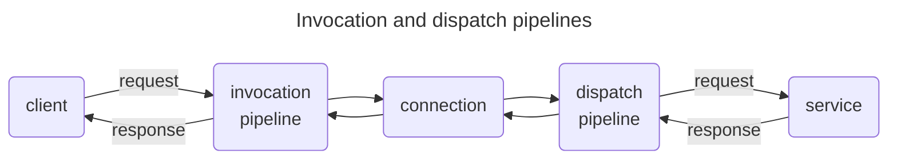

# IceRPC for C#

[![Continuous Integration][ci-badge]][ci-home]

[Getting started][getting-started] | [Examples][examples] | [Documentation][docs] | [API reference][api] | [Building from source][building]

IceRPC is a new RPC framework that helps you build networked applications with minimal effort.

Like any RPC framework, IceRPC provides two main components:
 - a runtime library that coordinates the sending and processing of requests and responses over network connections
(the IceRPC core)
 - an [Interface Definition Language][idl] (IDL) that allows you to define a high-level "contract" for your services and a
compiler that generates C# code from your contract's definitions (the Slice language and the Slice compiler)

However, unlike other RPC frameworks, IceRPC does not force you to use its IDL. IceRPC provides a convenient core API
that you can use to send and process requests and responses with the IDL and encoding of your choice, including
[Protobuf][protobuf] and [JSON][json].

## Built for QUIC

IceRPC was built from the ground up to take advantage of [QUIC][quic], the new multiplexed transport that underpins
[HTTP/3][http3].

QUIC is ideally suited for RPCs: an RPC consists of a request/response pair carried by a bidirectional QUIC stream.
Multiple request/response pairs can proceed in parallel inside the same QUIC connection without interfering with each
other. QUIC also gives us bidirectional streaming for free: long-lived requests and responses that carry audio/video
streams or streams of sensor data, stock quotes, etc. can share a network connection with small, short-lived RPCs.

IceRPC uses its own application protocol, [`icerpc`][icerpc-protocol], to exchange connection settings, transmit
requests and responses, and ensure an orderly shutdown. This new RPC-focused protocol is a thin layer over QUIC.

### Not only for QUIC

While QUIC is the driving force for IceRPC's protocol, IceRPC is not limited to communications over QUIC. IceRPC also
provides a multiplexing adapter that converts any traditional duplex transport into a QUIC-like multiplexed transport:
[Slic][slic]. This allows you to use `icerpc` over duplex transports such as TCP, Bluetooth, and named pipes[^1].

## Modern C# and .NET

IceRPC for C# takes full advantage of the latest C# syntax and .NET features and offers a truly modern C# API.

Chief among these features is async/await. Async/await allows you to utilize threads efficiently when making calls that
wait for I/O, and RPCs are all about network I/O. Async/await also makes your code easier to read and maintain: you can
see immediately when you make an RPC versus a local synchronous call since all RPC calls have `Async` APIs that are
usually awaited. For example:

```csharp
// Synchronous code (old RPC style)

// It's unclear if this is a remote call that takes milliseconds or a local call that takes
// at most a few microseconds. In any case, this call is holding onto its thread until it
// completes.
string greeting = greeterProxy.Greet(name);
```

```csharp
// Asynchronous code with await (modern RPC style)

// We see it's a special call thanks to await and the Async suffix. GreetAsync releases the
// thread while waiting for the response from the peer and it's just as easy to write as
// the synchronous version.
string greeting = await greeterProxy.GreetAsync(name);
```

> With IceRPC, all calls that make network I/O are Async and only Async. IceRPC does not provide a parallel blocking
> synchronous API.

IceRPC leverages [System.IO.Pipelines][pipelines] for maximum efficiency. This allows IceRPC to rent all its byte
buffers from the same configurable memory pool.

IceRPC naturally supports cancellation just like all modern C# libraries, with trailing cancellation token parameters.
This cancellation works "across the wire": when you cancel an outstanding RPC invocation, the remote service is notified
and can in turn cancel further processing.

## Modular and extensible

When you make an RPC with IceRPC, your request and response travel through an invocation pipeline (on the client side)
and a dispatch pipeline (on the server side):



These pipelines intercept your requests and responses and you decide what they do with them. If you want to log
your requests and responses, add the Logger interceptor to your invocation pipeline or the Logger middleware to
your dispatch pipeline. If you want to retry automatically failed requests that can be retried, add the Retry
interceptor to your invocation pipeline. IceRPC provides a number of interceptors and middleware for compression,
deadlines, logging, metrics, OpenTelemetry integration, and more. You can also easily create and install your own
interceptors or middleware to customize these pipelines.

Since all this functionality is optional and not hard-coded in the IceRPC core, you can choose exactly the behavior you
want. For example, you don't need the Compress interceptor if you're not compressing anything: if you don't install this
interceptor, there is no compression code at all. Less code means simpler logic, fewer dependencies, faster execution
and fewer bugs.

This modularity and extensibility is everywhere in IceRPC. You can easily implement a new duplex or multiplexed
transport and then plug it in IceRPC. All the transport interfaces are public and fully documented.

And you can use IceRPC with a [DI container][icerpc-with-di]—or not. It's all opt-in.

## Slice

[Slice][slice] is a completely revised version of [Ice][zeroc-ice]'s IDL (the [original Slice][ice-slice]), with a new
syntax, a new file extension (.slice), a new compilation model, additional keywords and more. It just keeps the same
terminology: modules, interfaces, operations, proxies, enums, etc. They have the same meaning in the new Slice language
as in the original language[^2].

The Slice language is RPC-centric: it's all about defining RPCs in a clear and concise manner, with just the right
feature set.

> Slice as a language is not tied to IceRPC. You can use Slice and the supporting [slicec][slicec] parser library with
> another RPC framework. However, the Slice compiler for C# ([slicec-cs][slicec-cs]) and the Slice library code
> ([IceRpc.Slice][icerpc-slice]) provided by this repository are IceRPC-specific.

Defining the customary Greeter interface in Slice is straightforward:

```slice
// Interface Greeter is implemented by a service hosted in a server.
interface Greeter {
    // The greet request carries the name of the person to greet and
    // the greet response carries the greeting created by the service
    // that implements Greeter.
    greet(name: string) -> string
}
```

You don't need to craft special request and reply message types: you can specify all your parameters inline.

The Slice compiler for C# then generates readable and succinct C# code from this Greeter interface:
 - a client-side `IGreeter` interface with a single `GreetAsync` method.
 - a client-side `GreeterProxy` that implements `IGreeter` by sending requests / receiving responses with the IceRPC
core
 - a server-side `IGreeterService` interface that you use as a template when writing the service that implements Greeter

Slice also supports streaming in both directions. For example:

```slice
interface Generator {
    // Returns a (possibly infinite) stream of int32
    generateNumbers() -> stream int32
}

interface Uploader {
    // Uploads an image (can be very large)
    uploadImage(image: stream uint8)
}
```

A stream of `uint8` is mapped to a C# `PipeReader` while a stream of any other type is mapped to an
`IAsyncEnumerable<T>`.

Slice provides common primitives types with easy-to-understand names:
 - string
 - bool
 - fixed-size integral types (int8, int16, int32, int64, uint8, uint16, uint32, uint64)
 - variable-size integral types (varint32, varint62, varuint32, varuint62)
 - floating point types (float32, float64)

And Slice provides a few constructed types to help you design more advanced RPCs: enum, struct, exception, sequence,
dictionary, and custom.

The [custom type][custom-type] allows you to send any C# type you wish through Slice, in keeping with IceRPC's mantra of
modularity and extensibility. You just need to provide methods to encode and decode instances of your custom type.

## Ice interop

IceRPC for C# provides a high level of interoperability with [Ice][zeroc-ice]. You can use IceRPC to write a new C#
client for your Ice server, and you can call services hosted by an IceRPC server from an Ice client.
[IceRPC for Ice users][icerpc-for-ice-users] provides all the details.

## License

IceRPC is licensed under the [Apache License version 2.0][license], a permissive open-source license.

This license allows you to use IceRPC in both open-source and closed source applications, free of charge. Please refer
to the license for the full terms and conditions.

[^1]: IceRPC for C# currently provides two duplex transport implementations: TCP (with or without TLS), and Coloc (an
in-memory transport for testing). Future releases may add additional transports.

[^2]: You can easily and mostly mechanically convert original Slice definitions into the new syntax.

[api]: https://api.testing.zeroc.com/csharp/
[building]: BUILDING.md
[ci-badge]: https://github.com/icerpc/icerpc-csharp/actions/workflows/dotnet.yml/badge.svg
[ci-home]: https://github.com/icerpc/icerpc-csharp/actions/workflows/dotnet.yml
[custom-type]: https://docs.testing.zeroc.com/slice/language-guide/custom-types
[docs]: https://docs.testing.zeroc.com/docs
[getting-started]: https://docs.testing.zeroc.com/getting-started
[examples]: examples
[http3]: https://en.wikipedia.org/wiki/HTTP/3
[icerpc-for-ice-users]: https://docs.testing.zeroc.com/icerpc-for-ice-users
[icerpc-protocol]: https://docs.testing.zeroc.com/icerpc-core/icerpc-protocol/mapping-rpcs-to-streams
[icerpc-with-di]: https://docs.testing.zeroc.com/icerpc-core/dependency-injection/di-and-icerpc-for-csharp
[idl]: https://en.wikipedia.org/wiki/Interface_description_language
[ice-slice]: https://doc.zeroc.com/ice/3.7/the-slice-language
[icerpc-slice]: src/IceRpc/Slice
[json]: examples/GreeterJson
[license]: LICENSE
[packages]: https://www.nuget.org/packages/IceRpc
[pipelines]: https://learn.microsoft.com/en-us/dotnet/standard/io/pipelines
[protobuf]: examples/GreeterProtobuf
[quic]: https://en.wikipedia.org/wiki/QUIC
[slic]: TBD
[slice]: https://docs.testing.zeroc.com/slice
[slicec]: https://github.com/icerpc/slicec
[slicec-cs]: tools/slicec-cs
[zeroc-ice]: https://github.com/zeroc-ice/ice
