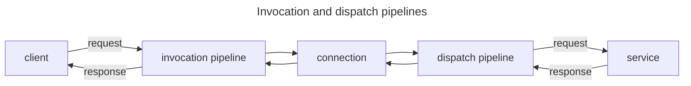

# IceRPC for C#

[![Continuous Integration][ci-badge]][ci] | [Getting started][getting-started] | [Examples][examples] | [Documentation][docs] | [API reference][api] | [Building from source][building]

IceRPC is a new RPC framework that helps you build networked applications with minimal effort.

Like any RPC framework, IceRPC provides two main components:
 - a runtime library that coordinates the sending and processing of requests and responses over network connections
(the IceRPC core)
 - an [Interface Definition Language][idl] that allows you to define a high-level "contract" for your services and a
compiler that generates C# code from your contract definitions (the Slice language and the Slice compiler)

However, unlike other RPC frameworks, IceRPC does not force you to use its IDL. IceRPC provides a convenient core API
that you can use to send and process requests and responses with the IDL and encoding of your choice, including
[Protobuf][protobuf] and [JSON][json].

## Built for QUIC

IceRPC was built from the ground up to take advantage of [QUIC][quic], the new multiplexed transport that underpins
[HTTP/3][http3].

QUIC is ideally suited for RPCs: a RPC consists of a request/response pair carried by a bidirectional QUIC stream.
Multiple request/response pairs can proceed in parallel inside the same QUIC connection without interfering with each
others. QUIC also gives us bidirectional streaming for free, with long-lived requests and responses that carry
audio/video streams or streams of sensor data, stock quotes, etc. sharing a network connection with small, short-lived
RPCs.

IceRPC uses its own application protocol to exchange connection settings, transmit requests and responses, and ensure
an orderly shutdown: [`icerpc`][icerpc-protocol]. This new RPC-focused protocol is a very thin layer over QUIC.

### Not only for QUIC

While QUIC is the driving force for IceRPC's protocol, IceRPC is not limited to communications over QUIC. IceRPC also
provides a multiplexing adapter that converts any traditional duplex transport into a QUIC-like multiplexed transport:
[Slic][slic]. This allows you to use `icerpc` over duplex transports such as TCP, Bluetooth and named pipes[^1].

## Modern C#

IceRPC for C# takes full advantage of the latest C# syntax and features and offers you a truly modern C# API.

Chief among these features is async/await. async/await allows you to utilize threads efficiently when making calls that
wait for IOs, and RPCs are all about network IOs. async/await also makes your code easier to read and maintain: you can 
see immediately when you make a RPC or when you make a local synchronous call since all RPC calls have `Async` APIs
that are usually awaited. For example:

```csharp
// Synchronous code (old RPC style)

// It's unclear if this is a remote call that takes milliseconds or a local call that takes at most a few microseconds. 
// In any case, this call is holding onto its thread until it completes.
string greeting = greeterProxy.Greet(name);
```

```csharp
// Asynchronous code with await (modern RPC style)

// We see it's a special call thanks to await and the Async suffix. GreetAsync releases the thread while waiting for 
// the response from the peer and it's just as easy to write as the synchronous version.
string greeting = await greeterProxy.GreetAsync(name);
```

> With IceRPC, all calls that make network IOs are Async and only Async. IceRPC does not provide a parallel blocking
> synchronous API.

IceRPC leverages [System.IO.Pipelines][pipelines] for maximum efficiency. This allows IceRPC to rent all its byte
buffers from the same configurable memory pool.

IceRPC naturally supports cancellation just like all modern C# libraries, with trailing cancellation token parameters.
This cancellation works "across the wire": when you cancel an outstanding RPC invocation, the remote service is notified
and can in turn cancel further processing.

## Modular and extensible

When you make a RPC with IceRPC, your request and response travel through an invocation pipeline (on the client side)
and a dispatch pipeline (on the server side):



You decide what these pipelines do. If you want to log your requests and responses, add the Logger interceptor
to your invocation pipeline or the Logger middleware to your dispatch pipeline. If you want to retry automatically 
failed requests that can be retried, add the Retry interceptor to your invocation pipeline. IceRPC provides a number 
of interceptors and middleware for compression, deadlines, logging, metrics, OpenTelemetry integration, and more. 
You can also easily create and install your own interceptor or middleware to customize these pipelines.

Since all this functionality is optional and not hard-coded in the IceRPC core, you can choose exactly the behavior you
want. For example, you don't need the Compress interceptor if you're not compressing anything: if you don't install this
interceptor, there is no compress code at all. Less code means simpler logic, fewer dependencies, faster execution and
fewer bugs.

This modularity and extensibility is everywhere in IceRPC. You can easily implement a new duplex or multiplexed
transport and then plug it in IceRPC. All the transport interfaces are public and fully documented.

You can even replace the built-in pipeline classes with your own classes without losing any interceptor or middleware.

And you can use IceRPC with a [DI container][icerpc-with-di]--or not. It's all opt-in.

## Slice

TBD

## Ice interop

IceRPC for C# provides a high-level of interoperability with [Ice][zeroc-ice]. You can use IceRPC to write a new C#
client for your Ice server, and you can call services hosted by an IceRPC server from an Ice client.
[IceRPC for Ice users][icerpc-for-ice-users] provides all the details.

## License

IceRPC is licensed under the [Apache License version 2.0][license], a permissive open-source license.

This license allows you to use IceRPC in both open-source and closed source applications, free of charge. Please refer
to the license for the full terms and conditions.

[^1]: IceRPC for C# currently provides two duplex transport implementations: TCP (with or without TLS), and Coloc (an
in-memory transport for testing). Future releases may add additional transports.

[api]: https://api.testing.zeroc.com/csharp/
[building]: BUILDING.md
[ci]: actions/workflows/dotnet.yml
[ci-badge]: actions/workflows/dotnet.yml/badge.svg
[docs]: https://docs.testing.zeroc.com/docs
[getting-started]: https://docs.testing.zeroc.com/docs/getting-started
[examples]: examples
[http3]: https://en.wikipedia.org/wiki/HTTP/3
[icerpc-for-ice-users]: https://docs.testing.zeroc.com/docs/icerpc-for-ice-users
[icerpc-protocol]: https://docs.testing.zeroc.com/docs/icerpc-core/icerpc-protocol/mapping-rpcs-to-streams
[icerpc-with-di]: https://docs.testing.zeroc.com/docs/icerpc-core/dependency-injection/di-and-icerpc-for-csharp
[idl]: https://en.wikipedia.org/wiki/Interface_description_language
[json]: examples/GreeterJson
[license]: LICENSE
[packages]: https://www.nuget.org/packages/IceRpc
[pipelines]: https://learn.microsoft.com/en-us/dotnet/standard/io/pipelines
[protobuf]: examples/GreeterProtobuf
[quic]: https://en.wikipedia.org/wiki/QUIC
[slic]: TBD
[zeroc-ice]: https://github.com/zeroc-ice/ice
