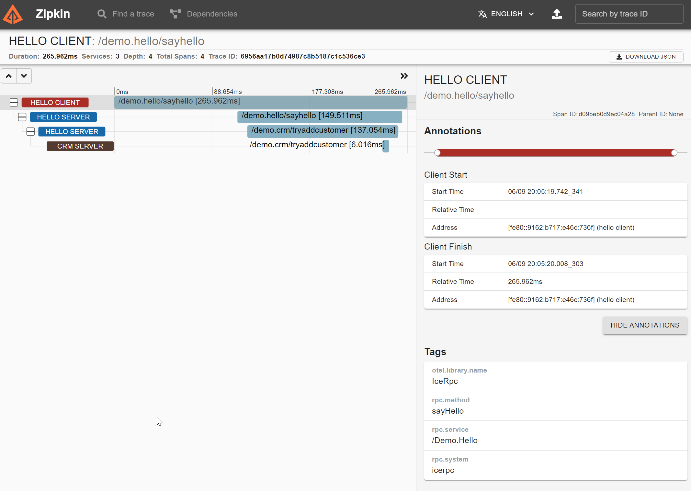

# OpenTelemetry

This application illustrates how to use the IceRPC telemetry interceptor and middleware, and how they can be integrated
with OpenTelemetry to export traces to Zipkin. The application also shows how the trace context is propagated from the
client to the front-end Greeter server, and from the front-end Greeter server to the back-end CRM server, by just
configuring the IceRPC telemetry interceptor and middleware.

For build instructions check the top-level [README.md](../README.md#building).

First start the Zipkin service as documented in the Zipkin quick start guide:

- [Zipkin quick-start](https://zipkin.io/pages/quickstart.html)

In a separate window start the CRM Server program:

```shell
dotnet run --project CrmServer/CrmServer.csproj
```

In a separate window start the Greeter Server program:

```shell
dotnet run --project GreeterServer/GreeterServer.csproj
```

In a separate window, start the Client program:

```shell
dotnet run --project Client/Client.csproj
```

The trace information should now be available in the Zipkin local service:

- <http://localhost:9411/zipkin>


