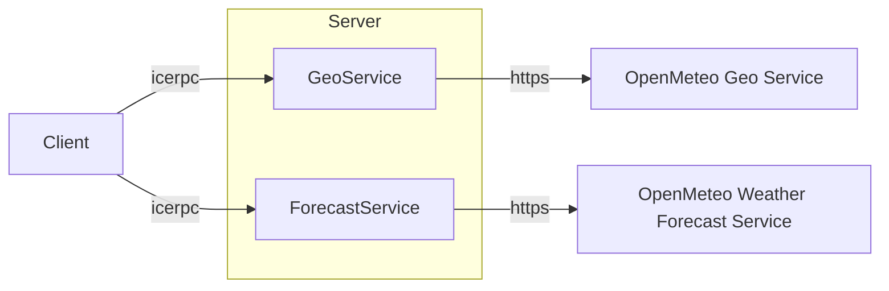

# Current Weather

This demo retrieves and displays the current weather conditions for a city or other named location.

This demo illustrates how to transport a JSON-encoded payload in an IceRPC response. This JSON-encoded payload is itself
returned by a REST service.

The server is essentially an IceRPC/HTTP bridge: it implements two IceRPC services by calling [Open Meteo] REST APIs.
All the "business logic" is in the client.



You can build the client and server applications with:

``` shell
dotnet build
```

First start the Server program:

```shell
cd Server
dotnet run
```

In a separate terminal, start the Client program and supply a city name, such as:

```shell
cd Client
dotnet run Paris
```

[Open Meteo]: https://open-meteo.com/