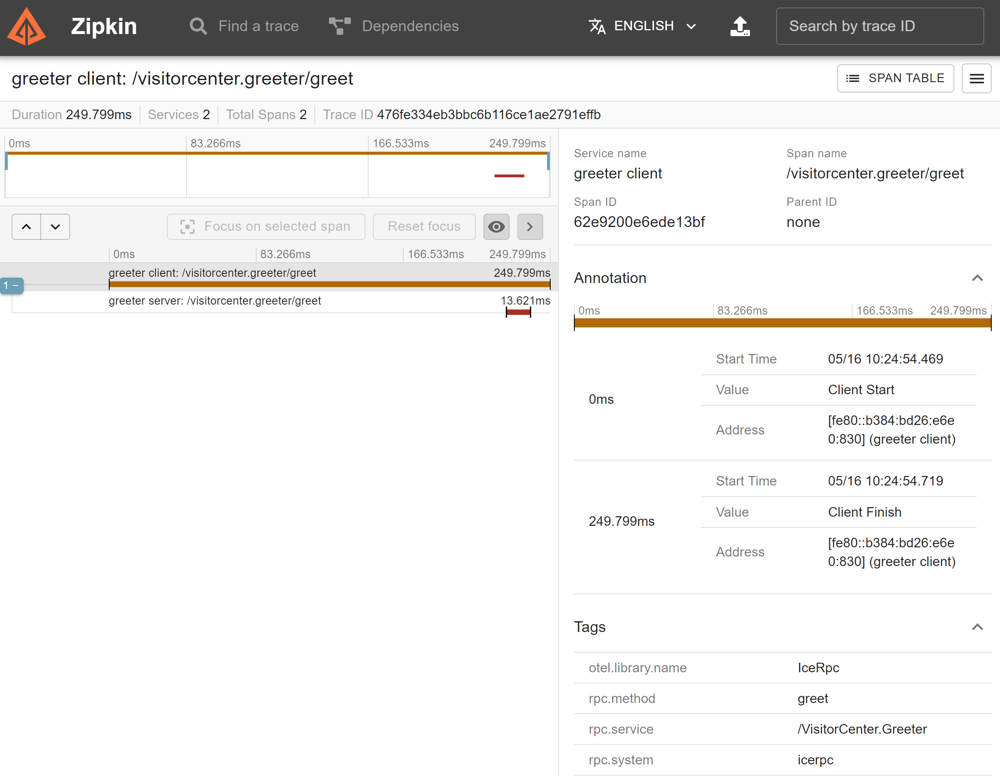

# Telemetry

This application illustrates how to use the IceRPC telemetry interceptor and middleware, and how they can be integrated
with OpenTelemetry to export traces to Zipkin. The application also shows how the trace context is propagated from the
client to the server, by just configuring the IceRPC telemetry interceptor and middleware.

You can build the client and server applications with:

``` shell
dotnet build
```

First start the Zipkin service as documented in the Zipkin quick start guide:

- [Zipkin quick-start](https://zipkin.io/pages/quickstart.html)

In a separate window start the Greeter Server program:

```shell
cd Server
dotnet run
```

In a separate window, start the Client program:

```shell
cd Client
dotnet run
```

The trace information should now be available in the Zipkin local service:

- <http://localhost:9411/zipkin>


