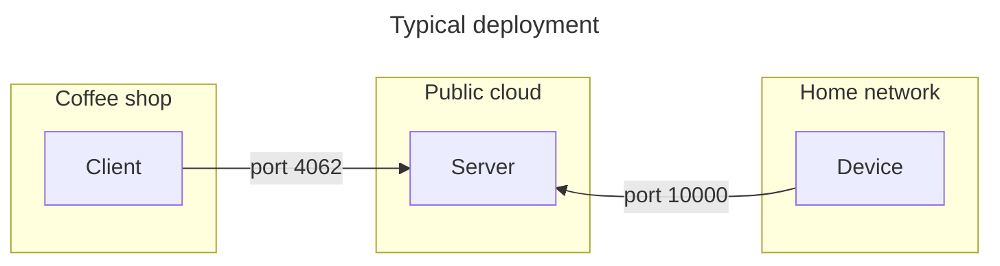

# Thermostat

This example presents an application with a client (think app running on your phone) that interacts with a device (a
thermostat in your home) via an intermediary server (such as a server deployed on a public cloud).

The device can only establish outgoing connections, so the client needs this intermediary server to reach it.

This example shows how you can send requests "the other way around" with IceRPC, from the server-side of a connection to
the client-side of this connection. The client sets the target temperature on the device (the technical term is "set
point") by calling a service in the server that in turns forwards the call to a service in the device.

It also shows a very simple publish-subscribe setup with streams: the device sends a stream of readings to the server,
and the server distributes these readings to the "subscribed" clients (all clients currently monitoring the device).

For simplicity and brevity, this example ignores authentication / security and supports only a single device at a time.

## Interactions



The arrows on the diagram indicate the client and server sides of the connection, not the flow of requests and
responses.

Server implements two Protobuf services using two separate services:

- `Thermostat`, the client-facing interface
- `ThermoHome`, the device-facing interface

Server also calls a service on the device that implements Protobuf service `ThermoControl`.

## Build and run

You can build the client, server and device with:

``` shell
dotnet build
```

First start the Server program:

```shell
cd Server
dotnet run
```

In a separate terminal, start the Device program:

```shell
cd Device
dotnet run
```

Then in another window, start the Client program:

```shell
cd Client
dotnet run
```

You can start multiple instances of the Client program. When you start Client with no arguments (as shown above), it
monitors the device until you press Ctrl+C or the Server shuts down.

You can also use Client to set a new target temperature ("set point") on the device. For example, you can change the
set point to 70°F with:

```shell
cd Client
dotnet run set 70
```
