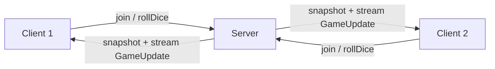

# Game of the Goose

This example implements a simplified [Game of the Goose][game-wiki] to demonstrate real-time state synchronization
across processes using IceRPC streams.

The server holds the authoritative game state. When a client joins, it receives a snapshot of the current state followed
by a stream of incremental event updates. Each client applies these events locally to stay in sync with the server,
which is a common pattern for games, chat rooms, and other interactive applications.

Key concepts demonstrated:
 - **Bidirectional communication** -- the server calls back into the client (via `GameUpdateSink`) to push updates
 - **Streaming** -- game events are delivered as an ordered `stream GameUpdate` parameter
 - **Snapshot + deltas** -- the client receives the full state once, then incremental changes
 - **Discriminated unions** -- `GameEvent` is a Slice enum with fields, modeling heterogeneous event types
 - **Request context** -- session IDs are passed via IceRPC request context to authenticate dice rolls

## Architecture



The server implements two Slice interfaces using a single service (`GameService`):
 - `GameRoom` -- lets players join the game
 - `GameSession` -- lets players roll the dice

Game logic (board rules, turn management, win conditions) is separated into a pure `Game` class that the service
delegates to.

## Game rules

The board has 40 spaces (0--39). Players start at space 0 and the first to reach space 39 wins.

 - **Goose spaces** (5, 9, 14, 18, 23, 27, 32) -- landing here bounces you forward to the next goose space and grants
   an extra turn. The last goose (32) bounces you to space 39 for the win.
 - **Trap spaces** (6, 12) -- landing here causes you to skip your next turn.

## Build and run

You can build the client and server with:

```shell
dotnet build
```

First start the Server program:

```shell
cd Server
dotnet run
```

By default, the server waits for 2 players. You can change this with the `--players` option (2--6):

```shell
cd Server
dotnet run -- --players 3
```

In a separate terminal, start a Client program:

```shell
cd Client
dotnet run
```

Then in another terminal, start a second Client. Once all players have joined, the game starts automatically. Press
Enter to roll the dice when it's your turn.

[game-wiki]: https://en.wikipedia.org/wiki/Game_of_the_Goose
